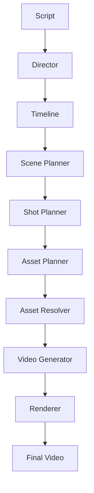

# Video Generation Engine

> **An AI-powered orchestration engine that transforms scripts into cinematic short-form videos through structured planning, intelligent asset selection, AI generation, and deterministic rendering.**

---

## Overview

Video Generation Engine is a backend platform for automating the production of short-form videos.

Unlike existing AI video generators that attempt to create an entire video in a single prompt, this project decomposes the creative process into deterministic production stages inspired by professional filmmaking.

The engine acts as an **AI production pipeline**, where specialized AI planners collaborate with deterministic services to transform a script into a fully rendered video.

---

## Vision

Build a production engine capable of converting

```text
Script
      ↓
Narrative Analysis
      ↓
Timeline Planning
      ↓
Scene Planning
      ↓
Shot Planning
      ↓
Asset Resolution
      ↓
Video Generation
      ↓
Rendering
      ↓
Final Short Video
```

The long-term vision is for this engine to become the core of a larger AI Studio capable of producing professional-quality documentary, educational, and marketing content.

---

# Core Principles

The project follows several engineering principles.

- AI plans.
- Code executes.
- Timeline is the source of truth.
- Rendering is deterministic.
- Human approval precedes expensive generation.
- Reuse assets before generating new ones.
- Modular architecture with replaceable providers.

---

# Repository Structure

```
video-generation-engine/

docs/
backend/
frontend/
docker/
infra/
scripts/
tests/
```

---

# Documentation

> **Start here:** [`docs/13_Implementation_Guide.md`](docs/13_Implementation_Guide.md) — the living build plan. It resolves contradictions between the frozen documents, defines the core contracts, and gives phase-by-phase strategy and advice. Any human or agent joining the project should read it before anything else.

| Document | Description |
|-----------|-------------|
| 13_Implementation_Guide.md | **Living** — invariants, canon, contracts, phased build plan |
| 00_Creative_Philosophy.md | Creative rules followed by every AI agent |
| 01_BRD.md | Business Requirements Document |
| 02_PRD.md | Product Requirements Document |
| 03_Engineering_Principles.md | Core engineering principles |
| 04_System_Architecture.md | High-level architecture |
| 05_Domain_Model.md | Domain-driven design |
| 06_Agent_Architecture.md | AI agent responsibilities |
| 07_Timeline_IR.md | Timeline intermediate representation |
| 08_Workflow_Engine.md | Workflow orchestration engine |
| 09_API_Specification.md | REST API specification |
| 10_Data_Model.md | Database schema |
| 11_Project_Roadmap.md | Milestones |
| 12_Testing_Strategy.md | Testing approach |

Architecture Decisions are stored under

```
docs/adr/
```

---

# MVP Scope

Version 1 focuses on a single workflow.

```
Script
      ↓
Timeline
      ↓
Scenes
      ↓
Shots
      ↓
Assets
      ↓
Video Clips
      ↓
Rendered Video
```

The engine will support:

- Timeline generation
- Scene planning
- Shot planning
- Asset discovery
- AI image/video generation
- Video rendering
- Caption generation
- Voice synchronization

The MVP deliberately excludes:

- Multi-user collaboration
- Brand memory
- Publishing to social platforms
- Analytics
- Long-term AI memory
- Research agent

---

# High-Level Architecture



---

# Core Components

## Orchestrator

Coordinates workflow execution.

Responsible for:

- workflow execution
- retries
- state transitions
- progress tracking

---

## Director

Transforms scripts into narrative structure.

Produces:

- scenes
- pacing
- emotions

---

## Scene Planner

Breaks narrative into visual scenes.

---

## Shot Planner

Determines:

- camera angle
- duration
- movement
- framing

---

## Asset Planner

Determines the optimal strategy for obtaining media.

Priority:

1. Existing project assets
2. Historical/public domain assets
3. Stock assets
4. AI-generated video
5. AI-generated image

---

## Renderer

Deterministically assembles:

- generated clips
- images
- narration
- captions
- transitions
- music

into the final rendered video.

---

# Technology Stack

## Backend

- Python 3.13
- FastAPI
- Pydantic v2
- SQLAlchemy
- PostgreSQL
- Redis

---

## AI

- OpenAI — planning agents
- fal.ai — image and video generation
- ElevenLabs — narration
- Provider abstraction layer

---

## Media

- FFmpeg

Future:

- Remotion

---

## Frontend

- Next.js
- React
- Tailwind CSS

---

# Development Philosophy

This repository is designed around one guiding principle.

> AI should make creative decisions.
>
> Software should execute them deterministically.

This separation allows:

- easier debugging
- reproducibility
- provider independence
- incremental regeneration
- deterministic rendering

---

# Project Status

Current Phase

```
Architecture & Core Engine Development
```

Current Goal

```
Script
        ↓
Final Short Video
```

---

# Roadmap

## Phase 1

- Repository setup
- Documentation
- Domain model
- Workflow engine

## Phase 2

- AI planning
- Timeline generation
- Asset planning

## Phase 3

- Rendering
- Video generation
- Final MP4 export

---

# License

This project is currently under active development.

License will be finalized before the first public release.